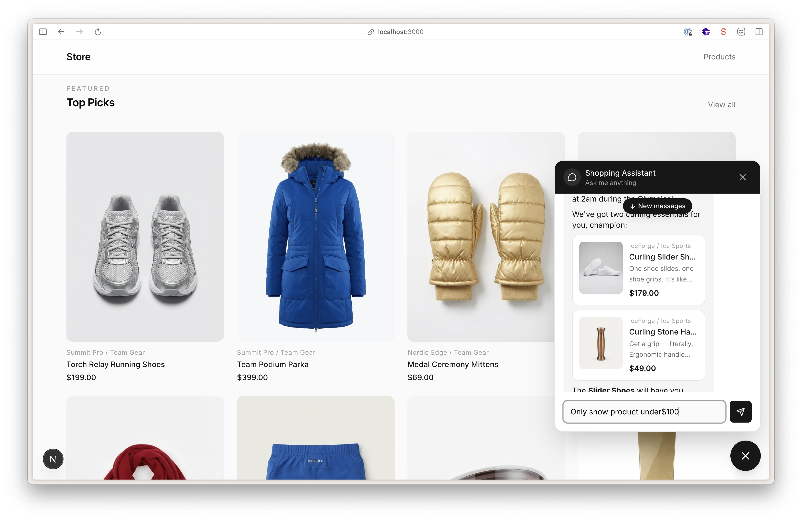

# Content-Powered AI Shopping Assistant

[](https://ai-shopping-assistant.sanity.dev/)

An ecommerce storefront with an AI shopping assistant that operates directly on your content. Built with Next.js 16, the Sanity Studio, and Claude, this starter uses [Context MCP](https://www.sanity.io/docs/ai/agent-context) to give the AI structured, schema-aware access to products in the Content Lake. The agent does not just search text; it understands your content model and reasons over it with GROQ queries.

**[Live Demo](https://ai-shopping-assistant.sanity.dev/)**

## Table of Contents

- [What's Included](#whats-included)
- [Prerequisites](#prerequisites)
- [Quick Start](#quick-start)
- [Project Structure](#project-structure)
- [How the Chatbot Works](#how-the-chatbot-works)
- [Agent Document Types](#agent-document-types)
  - [Agent Configs](#agent-configs-agentconfig)
  - [Agent Contexts](#agent-contexts-sanityagentcontext)
  - [Agent Conversations](#agent-conversations-agentconversation)
  - [Agent Insights](#agent-insights-studio-tool)
- [Environment Variables](#environment-variables)
- [Adding a Chatbot to Your Own Project](#adding-a-chatbot-to-your-own-project)
- [Learn More](#learn-more)

## What's Included

- **Next.js storefront**: Product listing, filtering, detail pages, and a floating chat widget
- **The Sanity Studio**: Content management with product schemas, agent configuration, and an insights dashboard
- **AI shopping assistant**: Claude-powered chatbot that queries the Content Lake to search products, answer questions, and apply filters
- **Claude Code skill**: A reusable skill for adding the chatbot to your own existing projects

## Prerequisites

- [Node.js](https://nodejs.org/) 18+
- A [Sanity account](https://www.sanity.io/get-started) (free)
- An [Anthropic API key](https://console.anthropic.com/)

## Quick Start

### 1. Create the project

```bash
pnpm create sanity@latest --template sanity-labs/starters/ai-shopping-assistant --package-manager pnpm
```

This scaffolds the project and walks you through Sanity project setup.

### 2. Import sample data (recommended)

```bash
cd your-project
pnpm import-sample-data
```

This populates your Content Lake with products, categories, brands, an agent config, and an Agent Context document with slug `default`. If you skip this step, you'll need to create content and configure Agent Context manually (see Step 4).

### 3. Set up environment variables

The install script already created `app/.env.local` and `studio/.env` with your project ID, dataset, and API tokens. You just need to add two more values:

1. **`ANTHROPIC_API_KEY`** — Add your key from [console.anthropic.com](https://console.anthropic.com) to both `app/.env.local` and `studio/.env`

2. **`SANITY_CONTEXT_MCP_URL`** — If you imported the sample data, the Agent Context slug is `default` and your MCP URL is:

   ```
   https://api.sanity.io/vX/agent-context/<your-project-id>/production/default
   ```

   Add this to `app/.env.local`. You can find your project ID in `studio/sanity.config.ts` or at [sanity.io/manage](https://sanity.io/manage).

3. **CORS origin** — If `http://localhost:3000` isn't listed in your project's CORS origins, add it so the frontend can talk to the Sanity API:

   ```bash
   cd studio && npx sanity cors add http://localhost:3000
   ```

   When prompted "Allow credentials to be sent from this origin?", answer **yes** — this is required for authenticated API requests from the frontend.

   You can check your existing origins at [sanity.io/manage](https://sanity.io/manage) → API → CORS Origins.

### 4. Configure Agent Context (if you skipped importing sample data)

If you didn't import sample data in Step 2, you need to create an Agent Context document manually:

```bash
cd ../ #
pnpm dev:studio
```

Open the Studio (usually http://localhost:3333) and:

1. Go to **Agents > Agent Contexts** and create a new Agent Context document
2. Give it a name and generate a slug (the slug becomes part of the MCP URL)
3. Configure which content the agent can access via the **Content Filter** field
4. Copy the **MCP URL** shown at the top of the document and add it to your `app/.env.local` as `SANITY_CONTEXT_MCP_URL`
5. **Publish the document.** The MCP endpoint only serves published documents

### 5. Deploy the Studio

```bash
cd studio && npx sanity deploy
```

> **Important:** The Agent Context MCP endpoint requires a deployed Studio. Deploying just the schema (`sanity schema deploy`) is not sufficient. Choose a hostname when prompted (e.g., `your-project-name`).

### 6. Start development

```bash
pnpm dev
```

This starts both the Next.js app (http://localhost:3000) and the Studio (http://localhost:3333) in parallel. You can also run them individually with `pnpm dev:app` and `pnpm dev:studio`.

### 7. Try the chatbot

Open [http://localhost:3000](http://localhost:3000) and click the chat bubble in the bottom-right corner. Try asking:

- "What products do you have?"
- "Show me jackets under $200"
- "What colors does this come in?"

## Project Structure

```
ai-shopping-assistant/
├── app/                              # Next.js 16 frontend
│   ├── src/
│   │   ├── app/
│   │   │   ├── api/chat/route.ts     # Chat API route (MCP + Claude)
│   │   │   ├── products/             # Product listing & detail pages
│   │   │   ├── layout.tsx            # Root layout with chat button
│   │   │   └── page.tsx              # Homepage
│   │   ├── components/
│   │   │   ├── chat/                 # Chat widget (Chat, Message, Input)
│   │   │   └── ...                   # Product cards, filters, header
│   │   ├── lib/
│   │   │   ├── client-tools.ts       # Tool definitions (shared server/client)
│   │   │   ├── capture-context.ts    # Page context & screenshot capture
│   │   │   └── save-conversation.ts  # Saves chats to Sanity for analysis
│   │   └── sanity/
│   │       ├── lib/client.ts         # Sanity client setup
│   │       └── queries/              # GROQ queries for products & categories
│   └── .env.example
├── studio/                           # Sanity Studio v5
│   ├── sanity.config.ts              # Studio config with plugins
│   ├── schemaTypes/                  # Document & object schemas
│   │   ├── documents/
│   │   │   ├── product.ts            # Product schema
│   │   │   ├── category.ts           # Category schema
│   │   │   ├── brand.ts              # Brand schema
│   │   │   ├── agentConfig.ts        # Agent config (system prompt)
│   │   │   ├── agentConversation.ts  # Stored conversations + classification
│   │   │   └── ...                   # color, material, size
│   │   └── objects/                  # Reusable object types
│   │       ├── productVariant.ts     # Size/color variant combos
│   │       ├── price.ts              # Price object
│   │       └── seo.ts               # SEO metadata
│   ├── agent-insights-tool/          # Custom Studio tool for viewing chat analytics
│   └── seed/                         # Sample dataset for import
├── functions/
│   └── agent-conversation/           # Sanity Function for auto-classifying chats
├── sanity.blueprint.ts               # Function triggers (delta filters)
├── skills/
│   └── add-sanity-chatbot/           # Claude Code skill for adding chatbot to other projects
├── package.json                      # Root workspace scripts
├── pnpm-workspace.yaml               # pnpm workspace config
└── CLAUDE.md                         # AI assistant context for this project
```

## How the Chatbot Works

1. **User sends a message** in the chat widget (`Chat.tsx` uses the [Vercel AI SDK's](https://sdk.vercel.ai/docs) `useChat` hook)
2. **API route receives the message** (`app/src/app/api/chat/route.ts`) along with the user's current page context
3. **MCP client connects to the Content Lake** to discover available tools (`groq_query`, `schema_explorer`, `initial_context`) scoped to your content
4. **Claude processes the message** using the system prompt (stored in the Studio) and available tools to search and reason over your product catalog
5. **Response streams back** with rich product cards rendered via custom markdown directives (`:document{id="..." type="..."}`)

The chatbot also has three client-side tools that run in the browser. **Page context** extracts the current page as markdown so Claude can understand what the user is looking at. **Screenshot capture** sends a visual screenshot to Claude's vision API so it can see product images, colors, and layout. **Product filters** let Claude update the product listing by navigating URL search params on the user's behalf. Claude uses these progressively — text context first, screenshots only when visuals matter — to keep interactions fast and token-efficient.

## Agent Document Types

The Studio groups three document types under **Agents** in the sidebar. Each plays a different role in the chatbot system.

### Agent Configs (`agent.config`)

Stores the **system prompt** that shapes how the chatbot behaves. The API route fetches this at request time, so you can edit the prompt in the Studio without redeploying.

| Field             | Purpose                                                                                                                                                                                         |
| ----------------- | ----------------------------------------------------------------------------------------------------------------------------------------------------------------------------------------------- |
| **Name**          | Display name for this config (e.g., "Shopping Assistant")                                                                                                                                       |
| **Slug**          | Unique identifier for this config. The app loads the config with slug `default`                                                                                                                 |
| **System Prompt** | Base instructions for agent behavior: persona, tone, communication style. Implementation-specific sections (page context, product directive syntax) are appended automatically by the API route |

**How it works:** The API route in `app/src/app/api/chat/route.ts` fetches the config with slug `default` via GROQ, then passes the `systemPrompt` field to Claude as the system message.

**Setup:** The sample data includes a default config. To customize it, open **Agents > Agent Configs** in the Studio and edit the system prompt. Changes take effect on the next chat message.

### Agent Contexts (`sanity.agentContext`)

Controls **what content the chatbot can access** in the Content Lake. This type is provided by the `@sanity/agent-context` plugin, not defined in your schema files.

| Field              | Purpose                                                                                                                        |
| ------------------ | ------------------------------------------------------------------------------------------------------------------------------ |
| **Name**           | Display name (e.g., "Product Catalog")                                                                                         |
| **Slug**           | Used to build the MCP URL that scopes the agent's access                                                                       |
| **Content Filter** | A GROQ filter that determines which documents the agent can query. Can be configured via a simple type-selector UI or raw GROQ |

**How it works:** The MCP URL you set in `SANITY_CONTEXT_MCP_URL` points to a specific Agent Context document. When the chatbot connects via MCP, it can only query documents matching that content filter. This gives you fine-grained control over what the agent sees.

**Setup:**

1. Open **Agents > Agent Contexts** in the Studio
2. Create a document with slug `default`
3. Configure the content filter to include the document types you want the agent to access (e.g., `product`, `category`, `brand`)
4. Copy the **MCP URL** shown at the top of the document into your `.env.local`
5. **Publish the document.** The MCP endpoint only works with published documents
6. **Deploy the Studio** (`npx sanity deploy`). The MCP endpoint requires a deployed Studio

### Agent Conversations (`agent.conversation`)

Stores **chat transcripts** and their **AI-generated classifications**. Every chat session is saved to the Content Lake automatically, then a Sanity Function analyzes it with Claude Haiku.

| Field              | Purpose                                                                                                   |
| ------------------ | --------------------------------------------------------------------------------------------------------- |
| **Summary**        | Auto-generated one-line description of what the user asked for                                            |
| **Messages**       | Array of `{role, content}` objects representing the full conversation                                     |
| **Classification** | Auto-generated scores: `successRate` (0-100), `agentConfusion` (0-100), `userConfusion` (0-100)           |
| **Content Gap**    | Auto-generated note about content the agent could not find (e.g., a product category that does not exist) |

**How it works:** When a chat ends, `app/src/lib/save-conversation.ts` writes the messages to the Content Lake using `SANITY_API_WRITE_TOKEN`. A Sanity Function defined in `functions/agent-conversation/index.ts` triggers on new or updated conversations (via the blueprint in `sanity.blueprint.ts`), classifies them with Claude Haiku, and patches the classification fields back onto the document. The delta filter in the blueprint ensures only message changes trigger classification, preventing infinite loops.

**Setup:**

1. `SANITY_API_WRITE_TOKEN` is set in `app/.env.local` (with Editor permissions)
2. Initialize the blueprint config (one-time setup):
   ```bash
   pnpm init:blueprints
   ```
   This creates a config file that links to your Sanity project. When prompted, select your Project ID and create or select a Stack.
3. Deploy the blueprint:
   ```bash
   pnpm deploy:blueprints
   ```
4. Add the `ANTHROPIC_API_KEY` to the deployed function via the CLI:
   ```bash
   npx sanity functions env add agent-conversation ANTHROPIC_API_KEY your-key
   ```
   See the [Sanity Functions env vars docs](https://www.sanity.io/docs/functions/function-env-vars) for details.

You can browse conversations and their scores in **Agents > Agent Conversations**, or use the **Agent Insights** tool in the Studio sidebar for an analytics dashboard.

### Agent Insights (Studio Tool)

A custom Studio tool that provides an analytics dashboard for monitoring chatbot performance. It appears in the Studio sidebar and has two views:

**Overview** — Aggregated stats across all conversations:

| Metric                  | Description                                                                  |
| ----------------------- | ---------------------------------------------------------------------------- |
| **Total Conversations** | Number of stored chat sessions                                               |
| **Avg Success Rate**    | Mean success score across all classified conversations (0–100%)              |
| **Avg Agent Confusion** | Mean agent confusion score (lower is better)                                 |
| **Avg User Confusion**  | Mean user confusion score (lower is better)                                  |
| **Content Gap Rate**    | Percentage of conversations where the agent could not find requested content |

**Conversations** — A table of every conversation, showing date, initial question, summary, content gap, and color-coded classification badges. Each row has two actions: inspect (opens a dialog with the full message transcript rendered as markdown) and link (navigates to the conversation document in the Studio).

**How it works:** The tool is registered as a Studio plugin in `studio/agent-insights-tool/agentInsightsPlugin.ts` and added in `studio/sanity.config.ts`. It queries `agent.conversation` documents directly using the Sanity client and displays the classification data that was written by the Sanity Function.

**Setup:** No additional configuration needed. The tool appears automatically in the Studio sidebar. It requires conversations to exist with classification data to show meaningful stats — see the [Agent Conversations](#agent-conversations-agentconversation) section above for how conversations are saved and classified.

## Environment Variables

| Variable                        | Required | Description                                                                                                     |
| ------------------------------- | -------- | --------------------------------------------------------------------------------------------------------------- |
| `NEXT_PUBLIC_SANITY_PROJECT_ID` | Yes      | Your Sanity project ID. Find it at [sanity.io/manage](https://sanity.io/manage) or in `studio/sanity.config.ts` |
| `NEXT_PUBLIC_SANITY_DATASET`    | Yes      | Sanity dataset name. Usually `production`                                                                       |
| `SANITY_API_READ_TOKEN`         | Yes      | Sanity API token with **Viewer** permissions. Create at sanity.io/manage -> API -> Tokens                       |
| `SANITY_API_WRITE_TOKEN`        | No       | Sanity API token with **Editor** permissions. Needed for saving conversations                                   |
| `SANITY_CONTEXT_MCP_URL`        | Yes      | The MCP URL from your Agent Context document in Studio                                                          |
| `ANTHROPIC_API_KEY`             | Yes      | Your Anthropic API key from [console.anthropic.com](https://console.anthropic.com)                              |

## Adding a Chatbot to Your Own Project

Already have a Next.js + Sanity project? Use the included Claude Code skill to add the AI chatbot to your site. It walks you through dependencies, API route, chat UI components, and Studio plugin setup.

Install the skill directly from GitHub:

```bash
npx skills add https://github.com/sanity-labs/starters/tree/main/ai-shopping-assistant --skill add-sanity-chatbot
```

Or, if you've cloned this repo locally:

```bash
npx skills add ./skills/add-sanity-chatbot
```

See [`skills/add-sanity-chatbot/SKILL.md`](skills/add-sanity-chatbot/SKILL.md) for the full workflow and reference docs.

## Learn More

- [Agent Context docs](https://www.sanity.io/docs/ai/agent-context)
- [Studio docs](https://www.sanity.io/docs/sanity-studio)
- [Vercel AI SDK docs](https://sdk.vercel.ai/docs)
- [Anthropic API docs](https://docs.anthropic.com/)
- [Next.js docs](https://nextjs.org/docs)
